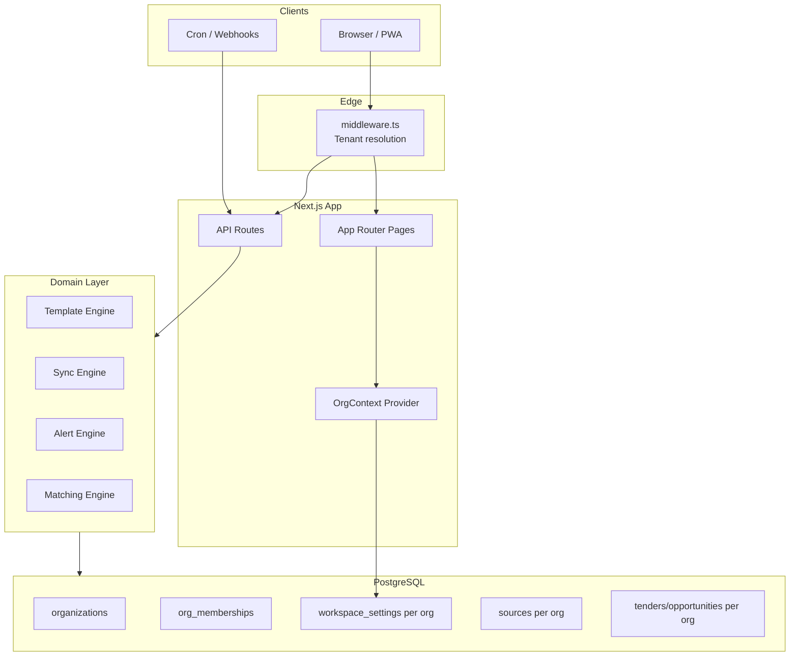
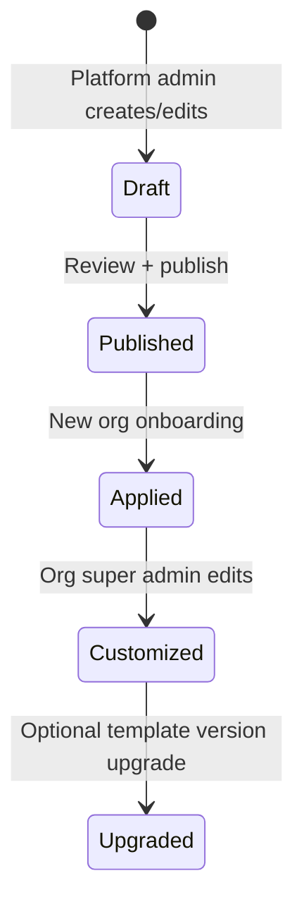
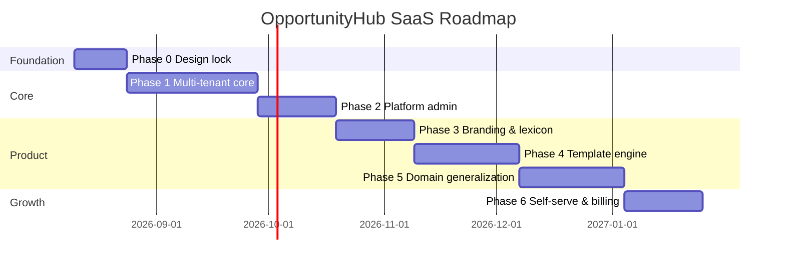

# GlobeTender Cloud — Multi-Tenant SaaS Implementation Plan

**Product name:** GlobeTender Cloud  
**Workspace host (target):** `gcstenders.globeconcs.com`  
**Staging host (current):** `gcstenders.netlify.app`  
**Default tenant (tenant zero):** `globecon`  
**Document version:** 1.1  
**Last updated:** August 2026  

> **DNS note:** Point `gcstenders.globeconcs.com` when ready. Until wildcard subdomains are live, the apex/staging host resolves to the default `globecon` organization. Future tenant URLs: `{slug}.gcstenders.globeconcs.com`.

**Product codename (legacy in doc):** OpportunityHub → **GlobeTender Cloud**

---

## Table of contents

1. [Executive summary](#1-executive-summary)
2. [Locked decisions](#2-locked-decisions)
3. [Product vision](#3-product-vision)
4. [Target architecture](#4-target-architecture)
5. [Multi-tenancy model](#5-multi-tenancy-model)
6. [Template system](#6-template-system)
7. [Domain model evolution](#7-domain-model-evolution)
8. [Phased implementation roadmap](#8-phased-implementation-roadmap)
9. [Phase details (epics & deliverables)](#9-phase-details-epics--deliverables)
10. [Database schema plan](#10-database-schema-plan)
11. [Tenant resolution & request lifecycle](#11-tenant-resolution--request-lifecycle)
12. [Auth, roles & platform admin](#12-auth-roles--platform-admin)
13. [Branding & lexicon runtime](#13-branding--lexicon-runtime)
14. [API & query scoping rules](#14-api--query-scoping-rules)
15. [UI / UX plan](#15-ui--ux-plan)
16. [Email, alerts & share pages](#16-email-alerts--share-pages)
17. [Sync engine & source adapters](#17-sync-engine--source-adapters)
18. [Migration from single-tenant (Globecon)](#18-migration-from-single-tenant-globecon)
19. [Security, isolation & compliance](#19-security-isolation--compliance)
20. [Commercial layer (billing & limits)](#20-commercial-layer-billing--limits)
21. [Infrastructure & DevOps](#21-infrastructure--devops)
22. [Testing strategy](#22-testing-strategy)
23. [Risk register](#23-risk-register)
24. [Success metrics](#24-success-metrics)
25. [Appendix A — Template JSON schema v0.1](#appendix-a--template-json-schema-v01)
26. [Appendix B — Lexicon keys](#appendix-b--lexicon-keys)
27. [Appendix C — File touch map (estimated)](#appendix-c--file-touch-map-estimated)

---

## 1. Executive summary

GlobeTenderV2 is a mature **single-workspace procurement intelligence** application. Commercialization means evolving it into **OpportunityHub**: a **multi-tenant SaaS platform** where any organization configures branding, terminology, catalogs, and data sources from **org templates**, then monitors, matches, alerts on, and shares **opportunities** relevant to their domain.

**Globecon Tender Watch** becomes the first tenant on the platform and the reference implementation of the **Procurement Intelligence** template — not the product itself.

### What we are building

| Layer | Description |
|-------|-------------|
| **Platform** | Globcons-operated SaaS hosting many organizations |
| **Organization (tenant)** | Isolated workspace with own users, data, branding, settings |
| **Template** | Pre-built configuration pack (procurement, HR, community, academic) |
| **Opportunity** | Generic domain entity (UI label varies: Tender, Job, Service need, Posting) |

### Recommended timeline (aggressive but realistic)

| Phase | Duration | Outcome |
|-------|----------|---------|
| Phase 0 — Foundation & design lock | 2 weeks | Schema approved, tenant middleware spec, template JSON v0.1 |
| Phase 1 — Multi-tenant core | 4–5 weeks | Orgs, memberships, scoped queries, tenant resolution |
| Phase 2 — Platform admin & onboarding | 3 weeks | Create org, invite super admin, subdomain routing |
| Phase 3 — Branding & lexicon runtime | 3 weeks | Dynamic UI, emails, share pages per org |
| Phase 4 — Template engine | 3–4 weeks | Apply template, catalog packs, feature flags |
| Phase 5 — Domain generalization | 4 weeks | Custom fields, template-driven filters & cards |
| Phase 6 — Self-serve & billing hooks | 3 weeks | Signup flow, plan limits, usage metering |
| **Total to MVP SaaS** | **~20–24 weeks** | Multi-tenant platform with 2+ templates live |

Parallel workstreams (DevOps, security review, docs) run throughout.

---

## 2. Locked decisions

These decisions are **fixed** for this plan. Where you did not specify, we chose the option that balances speed, safety, and long-term SaaS scalability.

### Confirmed by stakeholder

| Decision | Choice |
|----------|--------|
| Commercialization path | **Multi-tenant SaaS (Path B)** |
| Template-based org setup | **Yes** |
| Super admin customization | **Yes** (branding, terminology, catalog, recipients) |
| Vertical flexibility (HR, faith, academic, procurement) | **Yes** |

### Recommended defaults (approved for planning)

| Question | Recommendation | Rationale |
|----------|------------------|-----------|
| **First launch vertical** | **Procurement Intelligence** (Globecon as tenant zero) | Codebase is production-ready; validates tenancy without rewriting domain logic |
| **Second template** | **HR & Talent** | Proves template/lexicon system; large addressable market |
| **Onboarding model** | **Platform-admin provisioned beta → self-serve signup in Phase 6** | Reduces early support burden; learns onboarding friction before automating |
| **Data model approach** | **Pragmatic dual layer:** keep `tenders` table internally in Phase 1–4; add `opportunities` view alias + `custom_fields` JSONB; rename table in Phase 5 if needed | Avoids blocking SaaS on a large rename; UI uses lexicon immediately |
| **Sources model** | **Per-org sources** + **platform adapter library** (shared connector code, org-owned config/URLs) | Isolation + faster setup; World Bank etc. are opt-in per org |
| **Branding depth (MVP)** | Logo, display name, primary/accent colors, email header color, favicon URL | Covers 90% of white-label needs; custom domains in Phase 6+ |
| **Platform operator** | **Globcons runs central platform** with `platform_admin` role above org roles | Standard B2B SaaS model |
| **Tenant resolution (MVP)** | **`{slug}.yourdomain.com` subdomains** | Simple, secure, works on Vercel; custom domains later |
| **Database** | **Shared PostgreSQL (Neon)** with `org_id` on all tenant tables | Cost-efficient; RLS optional hardening in Phase 2 |
| **Billing (MVP)** | **Manual / invoice + plan limits in DB**; Stripe integration Phase 6 | Ship tenancy before payments complexity |
| **Free tier** | **14-day trial org** with limits (seats, sources, sync frequency) | Standard SaaS acquisition |

---

## 3. Product vision

### One-liner

> **OpportunityHub** — Configure your organization from a template. Ingest opportunities from your sources, score them against your priorities, alert your team, and share shortlists — in your brand, your language, your domain.

### Org archetypes (template packs)

| Template ID | Primary users | Opportunity label | Category label | Example sources |
|-------------|---------------|-------------------|----------------|-----------------|
| `procurement` | Consulting, contractors, procurement teams | Tender | Service line | World Bank, AfDB, PPIP, RSS |
| `hr` | HR departments, recruiters | Job opening | Department | Careers pages, job board RSS |
| `community` | Churches, NGOs, community orgs | Service need | Ministry / category | Internal lists, bulletins, forms |
| `academic` | Universities, lecturers, researchers | Posting | Discipline | University HR, grant portals |
| `custom` | Any | Configurable | Configurable | User-defined |

### What stays the same (engine)

- Sync adapters ingest external feeds → normalized records
- Keyword/category matching → relevance score
- Per-user filters → personalized views
- Email digests → workspace recipient list + personal opt-out
- RBAC → org-scoped roles
- Public share links → tokenized read-only views

### What changes (product layer)

- Every record belongs to an **organization**
- UI copy comes from **lexicon**, not hardcoded strings
- Visual identity comes from **branding** settings
- Initial setup comes from **templates**
- Platform admin can create/suspend orgs

---

## 4. Target architecture



### Layer responsibilities

| Layer | Responsibility |
|-------|----------------|
| **Middleware** | Resolve org from host header; attach `orgId` to request; block cross-tenant access |
| **OrgContext** | Server + client access to branding, lexicon, features, plan limits |
| **Template engine** | Apply/upgrade template defaults to org workspace |
| **Domain services** | All queries include `org_id`; no global tenant data reads |
| **Platform admin** | Separate route group `/platform/*` on apex domain only |

---

## 5. Multi-tenancy model

### Tenancy style: **Shared database, shared schema, row-level isolation**

Every tenant-scoped table gets `org_id NOT NULL` with indexes. Application enforces scoping; optional PostgreSQL RLS as defense-in-depth.

### Core entities

```
organizations
  ├── org_memberships (users ↔ orgs, role per org)
  ├── workspace_settings (1:1, replaces singleton id=1)
  ├── sources, service_lines, regions, countries (org-scoped catalog)
  ├── tenders (org-scoped opportunities)
  ├── sync_logs, email_*_log, tender_shares (org-scoped)
  └── user_permission_grants (org-scoped)

users (global identity)
  └── can belong to multiple orgs via org_memberships (future); MVP: one org per user email
```

### Isolation rules (non-negotiable)

1. **Every SELECT/UPDATE/DELETE** on tenant data includes `WHERE org_id = :currentOrgId`
2. **Every INSERT** sets `org_id` from resolved tenant context — never from client body
3. **Session JWT** carries `orgId` + `orgRole` (not just global role)
4. **Share tokens** resolve within org scope
5. **Cron jobs** iterate orgs explicitly — never global sync
6. **Integration tests** must include cross-tenant leakage tests

### MVP constraint: one org per user email

For MVP, keep `users.email` globally unique and one primary org membership. Multi-org users (consultant across clients) is Phase 7+ with org switcher.

---

## 6. Template system

### What a template contains

A template is a **versioned JSON document** stored in `platform_templates` table (and repo under `templates/`).

```json
{
  "id": "procurement",
  "version": "1.0.0",
  "name": "Procurement Intelligence",
  "description": "Monitor RFPs, tenders, and contracts from development finance and public procurement sources.",
  "branding": {
    "displayName": "Tender Watch",
    "primaryColor": "#2563eb",
    "accentColor": "#7c3aed"
  },
  "lexicon": { "...": "see Appendix B" },
  "catalog": {
    "regions": [...],
    "serviceLines": [...],
    "suggestedSources": [...]
  },
  "features": {
    "analytics": true,
    "publicShare": true,
    "sync": true,
    "matchScore": true,
    "export": true
  },
  "layout": {
    "homeCardVariant": "procurement",
    "sidebarSections": ["sources", "serviceLines", "regions", "countries"],
    "filterDefaults": { "hideClosed": true }
  },
  "notifications": {
    "enabled": true,
    "defaultPrefs": { "...": "DEFAULT_NOTIFICATION_PREFS" }
  }
}
```

### Template lifecycle



### Apply template (on org creation)

1. Insert `organizations` row with `template_id`, `template_version`
2. Insert `workspace_settings` from template branding + lexicon + notifications
3. Seed org-scoped catalog (regions, service lines) from template
4. Optionally install suggested sources (disabled by default; admin enables)
5. Create org super admin membership

### Template upgrades

- Non-destructive: add new default service lines if missing
- Never delete org customizations
- Super admin sees "Template update available" banner

---

## 7. Domain model evolution

### Phase 1–4: Lexicon-only abstraction (fast)

| Internal (code/DB) | User-facing (from lexicon) |
|--------------------|----------------------------|
| `tenders` | `{lexicon.opportunity}` |
| `service_lines` | `{lexicon.category}` |
| `sources` | `{lexicon.source}` |
| `match_score` | `{lexicon.matchScore}` |
| `closing_at` | `{lexicon.deadline}` |

Add to `tenders`:

```sql
custom_fields jsonb NOT NULL DEFAULT '{}'
-- e.g. HR: { "employmentType": "full-time", "salaryMin": 50000 }
-- e.g. Community: { "urgency": "high", "contactName": "..." }
```

### Phase 5: Optional physical rename

If technical debt becomes painful:

- `tenders` → `opportunities`
- `service_lines` → `category_lines`

Use database views or Drizzle aliases during transition. **Do not block SaaS launch on this rename.**

---

## 8. Phased implementation roadmap



---

## 9. Phase details (epics & deliverables)

### Phase 0 — Foundation & design lock (2 weeks)

**Goal:** No code ambiguity before tenancy work begins.

| Epic | Deliverables |
|------|--------------|
| P0.1 Schema design review | ERD, migration plan, rollback plan |
| P0.2 Template JSON v0.1 | `templates/procurement.json`, `templates/hr.json` |
| P0.3 Lexicon spec | All keys defined (Appendix B) |
| P0.4 Tenant resolution spec | Subdomain rules, local dev (`acme.localhost:3000`) |
| P0.5 Platform admin UX wireframes | Org list, create org, suspend org |
| P0.6 Migration plan for Globecon | Script: current DB → org_id=1 globecon |

**Exit criteria:** Schema PR approved; template files in repo; team alignment doc signed.

---

### Phase 1 — Multi-tenant core (4–5 weeks)

**Goal:** Data and requests are org-scoped end-to-end.

| Epic | Tasks |
|------|-------|
| P1.1 Organizations schema | `organizations`, `org_memberships`, migrate `workspace_settings` |
| P1.2 Add `org_id` columns | All tenant tables + backfill for Globecon org |
| P1.3 Tenant context | `lib/tenant/context.ts`, `getCurrentOrg()`, `requireOrg()` |
| P1.4 Middleware | Resolve org from subdomain; redirect unknown slugs |
| P1.5 Auth session update | JWT/session includes `orgId`, `orgRole` |
| P1.6 Query scoping | Refactor all Drizzle queries in `lib/tenders`, `lib/catalog`, `lib/alerts`, `lib/settings`, API routes |
| P1.7 User model | Login resolves org from host; validate membership |
| P1.8 Cross-tenant tests | Automated leakage tests |

**Key files to refactor:**

- `lib/db/schema.ts` — new tables, org_id columns
- `scripts/db-upgrade.ts` — migration statements
- `middleware.ts` — tenant resolution
- `auth.ts` / `lib/auth/session.ts` — org in session
- Every file under `app/api/**` and `lib/**/queries.ts`

**Exit criteria:** Two orgs on staging with isolated data; Globecon org fully migrated; zero cross-tenant reads in tests.

---

### Phase 2 — Platform admin & onboarding (3 weeks)

**Goal:** Globcons can provision new customers without SQL.

| Epic | Tasks |
|------|-------|
| P2.1 Platform admin role | `platform_admin` flag on user OR separate `platform_admins` table |
| P2.2 Platform routes | `/platform/orgs`, `/platform/orgs/new`, `/platform/orgs/[id]` on apex domain |
| P2.3 Create org flow | Name, slug, template picker, super admin email → invite |
| P2.4 Org lifecycle | Active / suspended / trial_expired states |
| P2.5 Subdomain provisioning | Document Vercel wildcard `*.app.opportunityhub.com` |
| P2.6 Org settings: general | Org name, slug (read-only after create), timezone |
| P2.7 Audit log (basic) | `platform_audit_log`: who created/suspended org |

**Exit criteria:** Platform admin creates `acme` org from UI; super admin receives invite; `acme.domain.com` works independently.

---

### Phase 3 — Branding & lexicon runtime (3 weeks)

**Goal:** Each org looks and reads like its own product.

| Epic | Tasks |
|------|-------|
| P3.1 Workspace branding API | GET/PATCH `/api/settings/branding` |
| P3.2 Workspace lexicon API | GET/PATCH `/api/settings/lexicon` |
| P3.3 OrgContext provider | Server component loads settings; client hook `useOrg()` |
| P3.4 Dynamic theme | Inject CSS variables from `primaryColor` / `accentColor` |
| P3.5 Dynamic logo | `AppLogo` reads org logo URL or fallback mark |
| P3.6 Lexicon helper | `t('opportunity')`, `t('opportunityPlural')` — server + client |
| P3.7 Replace hardcoded strings | UI, login, sidebar, profile, settings, share, exports |
| P3.8 Email templates | Pass org branding + lexicon into all email builders |
| P3.9 Metadata | `<title>`, manifest, OG tags per org (where feasible) |

**Exit criteria:** HR org shows "Jobs" everywhere; custom colors on login; emails say org display name.

---

### Phase 4 — Template engine (3–4 weeks)

**Goal:** New orgs start useful on day one.

| Epic | Tasks |
|------|-------|
| P4.1 Template storage | `platform_templates` table + seed from `templates/*.json` |
| P4.2 Apply on create | Org creation runs template applier |
| P4.3 Settings → Template tab | View current template, reset sections, upgrade banner |
| P4.4 Catalog packs | Template seeds regions, service lines, optional sources |
| P4.5 Feature flags | Hide analytics, sync, share based on `features` |
| P4.6 Layout variants | Sidebar sections driven by `layout.sidebarSections` |
| P4.7 Export/import config | Super admin downloads workspace JSON backup |

**Exit criteria:** Create org with `hr` template → HR labels + department seed data; create org with `procurement` → Globecon-like defaults.

---

### Phase 5 — Domain generalization (4 weeks)

**Goal:** Vertical-specific UX without forked codebases.

| Epic | Tasks |
|------|-------|
| P5.1 Custom fields schema | JSONB on tenders + template field definitions |
| P5.2 Dynamic card layout | Card component variants: procurement / hr / community |
| P5.3 Filter config | Template defines visible filter sections |
| P5.4 Matching generalization | Category keywords work for departments, ministries, disciplines |
| P5.5 Analytics labels | Dashboard metrics use lexicon |
| P5.6 Public share variants | Share page layout per template |
| P5.7 HR template v1 | Full second template shipped |

**Exit criteria:** HR and Procurement orgs feel like different products; same codebase.

---

### Phase 6 — Self-serve & billing hooks (3 weeks)

**Goal:** Customers can sign up; platform enforces plan limits.

| Epic | Tasks |
|------|-------|
| P6.1 Public signup | `/signup` on apex: org name, slug, template, admin account |
| P6.2 Trial logic | 14-day trial, cron checks `trial_ends_at` |
| P6.3 Plan limits | `max_seats`, `max_sources`, `sync_interval_hours` on org |
| P6.4 Enforcement | Block actions when over limit; upgrade prompts |
| P6.5 Stripe (optional MVP+) | Checkout, webhook, sync subscription status |
| P6.6 Custom domains (stretch) | `tenders.acme.com` CNAME mapping |

**Exit criteria:** Self-serve signup creates working org; trial expiry suspends sync; upgrade path documented.

---

## 10. Database schema plan

### New tables

```sql
-- Platform-level
CREATE TABLE organizations (
  id            serial PRIMARY KEY,
  name          text NOT NULL,
  slug          text NOT NULL UNIQUE,          -- subdomain
  status        text NOT NULL DEFAULT 'active', -- active | suspended | trial
  template_id   text NOT NULL,
  template_version text NOT NULL,
  plan          text NOT NULL DEFAULT 'trial',
  trial_ends_at timestamp,
  max_seats     integer NOT NULL DEFAULT 5,
  max_sources   integer NOT NULL DEFAULT 10,
  created_at    timestamp NOT NULL DEFAULT now(),
  updated_at    timestamp NOT NULL DEFAULT now()
);

CREATE TABLE org_memberships (
  id         serial PRIMARY KEY,
  org_id     integer NOT NULL REFERENCES organizations(id) ON DELETE CASCADE,
  user_id    integer NOT NULL REFERENCES users(id) ON DELETE CASCADE,
  role       user_role NOT NULL,
  is_active  boolean NOT NULL DEFAULT true,
  created_at timestamp NOT NULL DEFAULT now(),
  UNIQUE (org_id, user_id)
);

CREATE TABLE platform_templates (
  id          text PRIMARY KEY,
  version     text NOT NULL,
  name        text NOT NULL,
  payload     jsonb NOT NULL,
  is_published boolean NOT NULL DEFAULT false,
  created_at  timestamp NOT NULL DEFAULT now(),
  PRIMARY KEY (id, version)
);

CREATE TABLE platform_audit_log (
  id          serial PRIMARY KEY,
  actor_id    integer REFERENCES users(id),
  action      text NOT NULL,
  org_id      integer REFERENCES organizations(id),
  metadata    jsonb NOT NULL DEFAULT '{}',
  created_at  timestamp NOT NULL DEFAULT now()
);
```

### Modified tables (add org_id)

Apply to: `workspace_settings`, `sources`, `regions`, `countries`, `service_lines`, `tenders`, `sync_logs`, `email_alert_log`, `email_digest_log`, `tender_shares`, `user_permission_grants`.

```sql
ALTER TABLE workspace_settings
  DROP CONSTRAINT IF EXISTS workspace_settings_pkey,
  ADD COLUMN org_id integer NOT NULL REFERENCES organizations(id),
  ADD PRIMARY KEY (org_id);  -- 1:1 with org

ALTER TABLE tenders ADD COLUMN org_id integer NOT NULL REFERENCES organizations(id);
CREATE INDEX tenders_org_id_idx ON tenders(org_id);
-- repeat pattern for all tenant tables
```

### workspace_settings evolution

Replace singleton `id=1` with `org_id` PK:

```typescript
export type WorkspaceSettingsPayload = {
  organizationName: string;
  templateId: string;
  templateVersion: string;
  branding: WorkspaceBrandingSettings;
  lexicon: WorkspaceLexiconSettings;
  notifications: WorkspaceNotificationSettings;
  catalog: WorkspaceCatalogSettings;
  features: WorkspaceFeatureFlags;
  layout: WorkspaceLayoutSettings;
};
```

---

## 11. Tenant resolution & request lifecycle

### Subdomain rules

| Host | Behavior |
|------|----------|
| `app.opportunityhub.com` | Marketing / signup / platform admin |
| `platform.opportunityhub.com` | Platform admin (alternative) |
| `{slug}.app.opportunityhub.com` | Org workspace |
| `localhost:3000` | Dev: default org or `?org=slug` override |
| `{slug}.localhost:3000` | Dev: org slug via host parsing |

### Middleware flow

```
1. Parse host → extract slug (or null for apex)
2. If platform route (/platform/*) → require platform_admin, no org context
3. If org subdomain → load org by slug; 404 if missing/suspended
4. Attach org to request headers: x-org-id, x-org-slug
5. Existing auth middleware runs
6. Page/API handlers call getCurrentOrg() — never trust client orgId
```

### Local development

```bash
# /etc/hosts or dnsmasq
127.0.0.1 globecon.localhost
127.0.0.1 acme.localhost
```

---

## 12. Auth, roles & platform admin

### Role hierarchy

```
Platform level:
  platform_admin     — Globcons staff; manage all orgs

Organization level (per org_memberships.role):
  super_admin        — Full org control, branding, templates, team
  admin              — Catalog, users (limited), sync
  analyst            — Sync, save, export
  viewer             — Read only
```

### Session payload (extended)

```typescript
type SessionUser = {
  id: number;
  email: string;
  name: string;
  orgId: number;
  orgSlug: string;
  orgRole: UserRole;
  isPlatformAdmin?: boolean;
};
```

### Login flow

1. User visits `{slug}.app.opportunityhub.com/login`
2. Credentials validated against `users`
3. Membership verified: `org_memberships` where `org_id` + `user_id` + `is_active`
4. Session issued with org context
5. Wrong org subdomain → "No access to this organization"

---

## 13. Branding & lexicon runtime

### OrgContext (server-first)

```typescript
// lib/tenant/org-context.ts
export async function getOrgContext(): Promise<OrgContext> {
  const org = await requireCurrentOrg();
  const settings = await getWorkspaceSettings(org.id);
  return {
    org,
    branding: settings.branding,
    lexicon: settings.lexicon,
    features: settings.features,
    layout: settings.layout,
  };
}
```

### CSS variable injection

```tsx
// app/layout.tsx (org subdomain layouts)
<style>{`
  :root {
    --primary: ${hexToHsl(branding.primaryColor)};
    --accent: ${hexToHsl(branding.accentColor)};
  }
`}</style>
```

### Lexicon usage

```tsx
// Before
<h1>Tenders</h1>

// After
<h1>{lexicon.opportunityPlural}</h1>
```

All new UI strings must use lexicon keys — enforced in code review.

---

## 14. API & query scoping rules

### Mandatory pattern

```typescript
export async function listTenders(orgId: number, filters: FilterState) {
  return db
    .select()
    .from(tenders)
    .where(and(eq(tenders.orgId, orgId), ...buildFilterConditions(filters)));
}
```

### API route pattern

```typescript
export async function GET() {
  const user = await requireSessionUser();
  const org = await requireOrg(user); // validates membership
  const data = await listTenders(org.id, ...);
  return NextResponse.json(data);
}
```

### Cron pattern

```typescript
export async function GET() {
  const orgs = await listActiveOrgs();
  for (const org of orgs) {
    await syncOrgSources(org.id);
    await runOrgAlerts(org.id);
  }
}
```

### Deny list

- Never accept `orgId` from request body for authorization
- Never query without org scope except platform admin routes
- Never use singleton `workspace_settings.id = 1`

---

## 15. UI / UX plan

### New surfaces

| Surface | Route | Audience |
|---------|-------|----------|
| Marketing home | `app.opportunityhub.com` | Public |
| Signup wizard | `/signup` | Public |
| Platform admin | `/platform/orgs` | platform_admin |
| Org workspace | `{slug}.app.../`` | Org members |
| Settings → Branding | `/settings/branding` | org super_admin |
| Settings → Terminology | `/settings/terminology` | org super_admin |
| Settings → Template | `/settings/template` | org super_admin |
| Settings → Plan | `/settings/plan` | org super_admin |

### Settings hub (expanded)

```
Settings
├── Notifications     (existing — org-scoped)
├── Delegations       (existing — org super_admin)
├── Branding          (Phase 3)
├── Terminology       (Phase 3)
├── Template          (Phase 4)
└── Plan & usage      (Phase 6)
```

### Signup wizard (Phase 6)

```
Step 1: Organization name + slug
Step 2: Choose template (cards with previews)
Step 3: Admin account (name, email, password)
Step 4: Confirm → create org → redirect to subdomain
```

### Template preview cards

Each template shows: screenshot mock, sample labels, suggested sources, ideal for (HR, Procurement...).

---

## 16. Email, alerts & share pages

### Per-org email branding

| Element | Source |
|---------|--------|
| From name | `org.branding.displayName` or org-level SMTP config (future) |
| Header color | `org.branding.primaryColor` |
| Logo | `org.branding.logoUrl` |
| Body copy | Lexicon keys |
| Footer | "Sent by {displayName}" |

### Alerts

- `getAlertUsers(orgId)` — workspace recipient list scoped to org
- Digest cron loops orgs
- Email logs include `org_id`

### Share pages

- Token resolves within org
- Page uses org branding + lexicon
- "Shared via {displayName}" footer

### Future: per-org SMTP

Phase 7+: org brings own Gmail/SMTP credentials stored encrypted in `workspace_settings.email`.

---

## 17. Sync engine & source adapters

### Per-org sources

- Each org installs/enables sources independently
- Source slugs unique **per org**: `UNIQUE (org_id, slug)`
- Sync cron: `for each org → for each enabled source → adapter.run(orgContext)`

### Platform adapter library

Shared code in `lib/sync/*`; org config in DB:

```typescript
{
  orgId: 12,
  adapter: "world-bank",
  url: "...",
  enabled: true,
}
```

### Template suggested sources

On template apply, insert suggested sources as `enabled: false`; admin enables in UI.

### User-Agent / external identity

Replace `GlobeconTenderWatch/2.0` with `OpportunityHub/2.0 (+https://app.opportunityhub.com)`.

---

## 18. Migration from single-tenant (Globecon)

### One-time migration script (`scripts/migrate-to-saas.ts`)

```
1. CREATE organizations row:
   name: "Globecon"
   slug: "globecon"
   template_id: "procurement"

2. INSERT org_memberships for all existing users
   (super_admin → super_admin, etc.)

3. ADD org_id = globecon.id to all tenant tables (backfill)

4. Migrate workspace_settings id=1 → org_id=globecon.id

5. Update auth: existing sessions invalidated (one-time logout)

6. Configure DNS: globecon.app.opportunityhub.com
```

### Zero-downtime strategy

1. Deploy schema migration with nullable `org_id`
2. Backfill Globecon org
3. Make `org_id NOT NULL`
4. Deploy app code with tenant resolution
5. Switch DNS to subdomain

---

## 19. Security, isolation & compliance

### Must-have for SaaS launch

| Control | Implementation |
|---------|----------------|
| Row-level isolation | org_id on all queries |
| Cross-tenant tests | CI suite |
| Suspended org blocking | Middleware returns 403 |
| Rate limiting | Per-org API limits (Vercel/middleware) |
| Password policy | Existing bcrypt; add min length on signup |
| Audit log | Platform admin actions |
| Secrets | Per-deployment env; no org secrets in client |
| Share token entropy | Existing hash approach; scoped to org |

### Phase 2+ hardening

- PostgreSQL Row Level Security policies
- SOC2-friendly logging
- Data export / delete org (GDPR)
- Pen test before public self-serve

---

## 20. Commercial layer (billing & limits)

### Plans (initial)

| Plan | Seats | Sources | Sync | Price hint |
|------|-------|---------|------|------------|
| Trial | 5 | 5 | Daily | Free 14 days |
| Starter | 10 | 15 | Daily | $ |
| Pro | 25 | 50 | Hourly | $$ |
| Enterprise | Unlimited | Unlimited | Custom | Custom |

### Limit enforcement points

- Create user → check `max_seats`
- Add source → check `max_sources`
- Cron sync frequency → check plan
- Trial expiry → set `status = suspended`, disable sync

### Stripe mapping (Phase 6)

```
organizations.stripe_customer_id
organizations.stripe_subscription_id
organizations.plan
```

---

## 21. Infrastructure & DevOps

### DNS

```
*.app.opportunityhub.com  → Vercel production
app.opportunityhub.com    → marketing + signup
```

### Environments

| Env | Purpose |
|-----|---------|
| `development` | localhost multi-subdomain |
| `staging` | `*.staging.opportunityhub.com` |
| `production` | `*.app.opportunityhub.com` |

### CI additions

- Migration dry-run on PR
- Cross-tenant isolation test job
- Template JSON schema validation

### Observability

- Structured logs: `{ orgId, orgSlug, userId, action }`
- Error tracking tagged by org
- Sync job metrics per org

---

## 22. Testing strategy

### Test categories

| Category | Examples |
|----------|----------|
| Unit | Lexicon helper, template applier, tenant context |
| Integration | API routes return only org data |
| Cross-tenant | User A @ org1 cannot read org2 tender by ID |
| E2E | Signup → login → sync → alert → share |
| Template | Apply HR template → correct seed data + labels |
| Migration | Globecon backfill script on copy of prod DB |

### Required before production SaaS

- [ ] 100% API routes use org scope
- [ ] Cross-tenant test suite green
- [ ] Two orgs manual QA on staging
- [ ] Globecon migration tested on staging DB clone

---

## 23. Risk register

| Risk | Impact | Mitigation |
|------|--------|------------|
| Missed org_id in query → data leak | Critical | Code review checklist, CI grep, cross-tenant tests |
| Large refactor breaks Globecon | High | Migrate Globecon first; feature flags |
| Subdomain SSL complexity | Medium | Vercel wildcard cert |
| Template sprawl | Medium | Versioned templates; max 5 for MVP |
| Scope creep (billing, custom domains) | Medium | Phase 6 optional; MVP = manual billing |
| Performance at scale | Medium | Indexes on org_id; paginate all lists |
| Email deliverability per org | Medium | Shared sender MVP; per-org SMTP later |

---

## 24. Success metrics

### MVP launch (Phase 1–4 complete)

- Globecon running as tenant on subdomain
- 2nd org created via platform admin in < 5 minutes
- HR template org feels distinct (labels + seed data)
- Zero cross-tenant incidents in staging QA

### 90 days post-launch

- 10+ paying orgs
- Self-serve signup conversion > 20%
- Time-to-first-sync < 15 minutes after signup
- NPS from org super admins > 40

---

## Appendix A — Template JSON schema v0.1

```typescript
type PlatformTemplate = {
  id: string;
  version: string;
  name: string;
  description: string;
  branding: {
    displayName: string;
    primaryColor: string;
    accentColor: string;
    logoUrl?: string;
  };
  lexicon: WorkspaceLexiconSettings;
  catalog: {
    regions?: SeedRegion[];
    serviceLines?: SeedServiceLine[];
    suggestedSources?: SeedSource[];
  };
  features: {
    analytics: boolean;
    publicShare: boolean;
    sync: boolean;
    matchScore: boolean;
    export: boolean;
  };
  layout: {
    homeCardVariant: "procurement" | "hr" | "community" | "academic";
    sidebarSections: Array<
      "sources" | "serviceLines" | "regions" | "countries" | "departments"
    >;
    filterDefaults?: Partial<FilterState>;
  };
  notifications: {
    enabled: boolean;
    defaultPrefs: NotificationPrefs;
  };
  customFields?: CustomFieldDefinition[];
};
```

---

## Appendix B — Lexicon keys

Minimum lexicon for MVP:

```typescript
type WorkspaceLexiconSettings = {
  // Core entities
  opportunity: string;           // "Tender" | "Job opening"
  opportunityPlural: string;   // "Tenders" | "Jobs"
  source: string;              // "Source" | "Job board"
  sourcePlural: string;
  category: string;            // "Service line" | "Department"
  categoryPlural: string;

  // Fields
  deadline: string;              // "Closing date" | "Apply by"
  matchScore: string;          // "Match score" | "Fit score"
  region: string;
  country: string;

  // Actions
  save: string;                // "Save tender" | "Save job"
  export: string;
  share: string;
  sync: string;

  // Nav
  navHome: string;             // "Tenders" | "Jobs"
  navAnalytics: string;
  navProfile: string;
  navSettings: string;
  navTeam: string;

  // Empty states
  emptyOpportunities: string;
  emptyOpportunitiesHint: string;

  // Product
  productTagline: string;      // "Tender Watch" | "Careers Hub"
};
```

---

## Appendix C — File touch map (estimated)

### New files (~40)

```
docs/SAAS_IMPLEMENTATION_PLAN.md          (this document)
templates/procurement.json
templates/hr.json
templates/community.json
templates/academic.json
lib/tenant/context.ts
lib/tenant/resolution.ts
lib/tenant/middleware.ts
lib/templates/apply.ts
lib/templates/load.ts
lib/lexicon/index.ts
lib/platform/orgs.ts
lib/platform/audit.ts
components/providers/org-provider.tsx
components/platform/org-list.tsx
components/platform/create-org-form.tsx
components/settings/branding-settings.tsx
components/settings/lexicon-settings.tsx
components/settings/template-settings.tsx
app/platform/layout.tsx
app/platform/orgs/page.tsx
app/platform/orgs/new/page.tsx
app/signup/page.tsx
app/api/platform/orgs/route.ts
app/api/settings/branding/route.ts
app/api/settings/lexicon/route.ts
scripts/migrate-to-saas.ts
tests/tenant/isolation.test.ts
```

### Major refactors (~60 files)

```
lib/db/schema.ts
scripts/db-upgrade.ts
middleware.ts
auth.ts
lib/auth/session.ts
lib/settings/workspace.ts
lib/alerts/queries.ts
lib/alerts/engine.ts
lib/tenders/queries.ts
lib/catalog/manage.ts
lib/sync/engine.ts
lib/email/templates.ts
lib/email/account-templates.ts
lib/email/html.ts
components/brand/app-logo.tsx
components/layout/app-shell.tsx
components/layout/sidebar-panel.tsx
components/tenders/tender-card.tsx
components/filters/sidebar-filters.tsx
app/layout.tsx
app/api/** (all routes)
```

---

## Next steps (immediate)

1. **Review this document** — confirm slug naming (`globecon.app.opportunityhub.com`) and product name (OpportunityHub vs keep GlobeTender brand for platform).
2. **Phase 0 kickoff** — schema ERD review session; create `templates/procurement.json` from current seed data.
3. **Branch strategy** — long-lived `feat/saas-multitenancy` branch; merge phases incrementally.
4. **Do not start Phase 1 code** until Phase 0 schema is approved (prevents rework).

---

*This plan assumes multi-tenant SaaS from day one. Globecon is tenant zero. Templates make vertical expansion a configuration problem, not a fork problem.*
